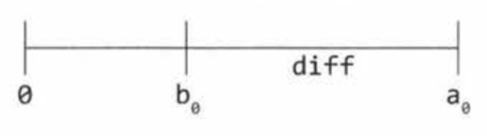

<h2>16.1 Number Swapper:</h2>
<p>
    Write a function to swap a number in place (that is, without temporary variables). Hints: #492, #716, #737
<p>
<p>
    This is a classic interview problem, and it's a reasonably straight forward one. We'll walk through this using a_O to indicate the original value of a and b_O indicate the original value of b. We'll also use diff to indicate the value of a_O - b_O.
    Let's picture these on a number line for the case where a > b.
</p>

<p>
    First, we briefly set a to diff, which is the right side of the above number line. Then, when we add b and diff (and store that value in b), we get a_O. We now have b = a_O and a = diff. All that's left to do is to set a equal to a_O, which is just b - a. The code below implements this.
</p>
<code>
    // Example for a = 9, b = 4
</code>

```python
a = a - b # a = 9 - 4 = 5
b = a + b # b = 5 + 4 = 9
a = b - a # a = 9 - 5
```